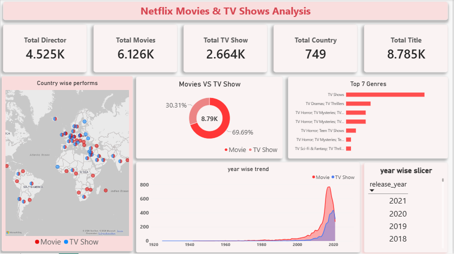

# 🎬 Netflix Movies & TV Shows Analysis

## 📌 Objective
Analyzing Netflix's content library (2008-2021) to understand its content strategy — the split between Movies and TV Shows, popular genres, top content-producing countries, and how Netflix's content library grew over time.

## 📊 Dataset
- **Source**: [Netflix Movies and TV Shows Dataset (Kaggle)](https://www.kaggle.com/datasets/shivamb/netflix-shows)
- **Size**: 8,807 rows, 12 columns (cleaned to 8,790 rows)
- **Columns**: show_id, type, title, director, cast, country, date_added, release_year, rating, duration, listed_in (genre)

## 🛠️ Tools Used
- **Python (Pandas)** — Data Cleaning
- **MySQL** — Data Analysis (SQL Queries)
- **Power BI** — Data Visualization & Dashboard

## 🧹 Data Cleaning Process (Python)
1. Removed an unnecessary column (`description`)
2. Handled missing values:
   - Low missing % columns (date_added, rating, duration) → Dropped rows
   - High missing % columns (director, cast, country) → Filled with "Unknown"
3. Fixed date format inconsistencies (removed leading spaces, converted to proper DATE format)
4. Replaced commas with semicolons in multi-value columns (cast, director, country, listed_in) to avoid SQL import/parsing issues
5. Verified zero duplicates in the dataset

## 🔍 SQL Analysis — Key Questions Answered
1. Movies vs TV Shows — which is more common on Netflix?
2. Top genres/content categories
3. Top content-producing countries
4. Year-wise content addition trend (2012-2021)
5. Top directors (and an insight into missing director data)
6. Average movie duration vs average TV show seasons

## 💡 Key Insights
- **Movies dominate** Netflix's library — 6,126 Movies vs 2,664 TV Shows (~70% vs 30%)
- **United States** is the largest content contributor (2,809 titles), followed by **India** (972 titles)
- **2019 was the peak year** for content addition (2,016 titles), followed by a decline in 2020-21 — likely due to COVID-19 production delays
- **~30% of directors** had missing data in the original dataset — an important data quality observation
- Average Movie duration: **~99.6 minutes**; Average TV Show length: **~1.75 seasons** — suggesting Netflix favors limited series over long-running shows
- International Movies and Dramas are the most common genres in Netflix's content library

## 📈 Dashboard Preview
The dashboard includes:
- KPI Cards (Total Titles, Movies, TV Shows, Countries, Directors)
- Movies vs TV Shows breakdown (Donut Chart)
- Top Genres (Bar Chart)
- Year-wise Content Trend (Line Chart)
- Country-wise performance (Map)
- Year Slicer for interactive filtering

## 📁 Repository Structure
```
├── main.py                          # Data cleaning script
├── netflix_titles.csv               # Raw dataset
├── netflix_cleaned.csv              # Cleaned dataset
├── 01_movies_vs_tvshows.sql
├── 02_top_genres.sql
├── 03_top_countries.sql
├── 04_year_wise_content_trend.sql
├── 05_top_directors.sql
├── 06_duration_analysis.sql
├── Netflix_Dashboard.pbix           # Power BI Dashboard file
└── README.md
```

## 🎯 What I Learned
During this project, I learned:
- How to clean real-world messy data (encoding issues, inconsistent formats, missing values)
- Practical use of SQL concepts like `LIKE`, `GROUP BY`, `SUBSTRING_INDEX`, and date functions
- Pushing data directly from Python to MySQL using SQLAlchemy
- Building interactive Power BI dashboards — cards, charts, maps, and slicers
